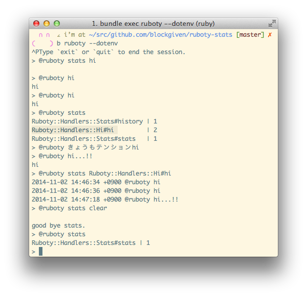

# Ruboty::Stats

ruboty plugin for record action stats.



## Installation

Add this line to your application's Gemfile:

```ruby
gem 'ruboty-stats'
```

And then execute:

    $ bundle

Or install it yourself as:

    $ gem install ruboty-stats

## Usage

    @ruboty stats
    @ruboty stats Ruboty::Handlers::Stats#stats
    @ruboty stats clear

## Contributing

1. Fork it ( https://github.com/blockgiven/ruboty-stats/fork )
2. Create your feature branch (`git checkout -b my-new-feature`)
3. Commit your changes (`git commit -am 'Add some feature'`)
4. Push to the branch (`git push origin my-new-feature`)
5. Create a new Pull Request
